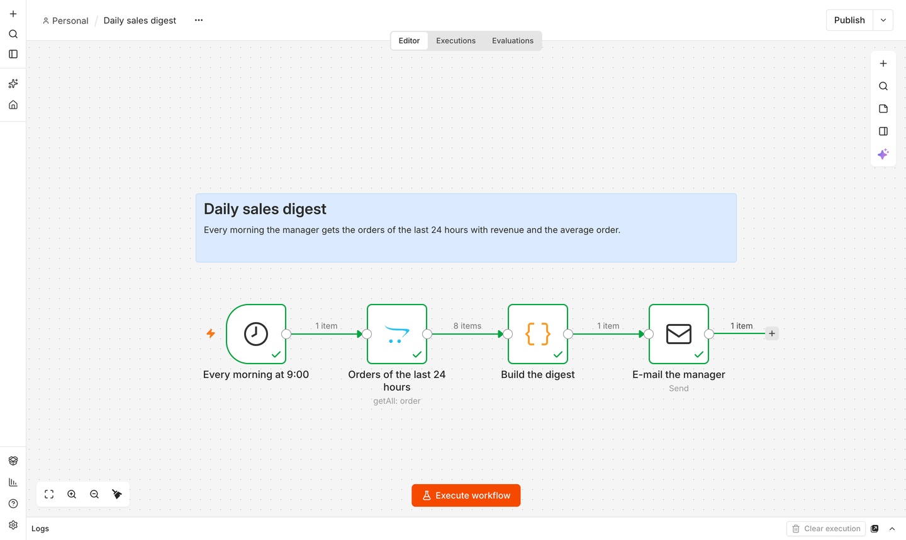
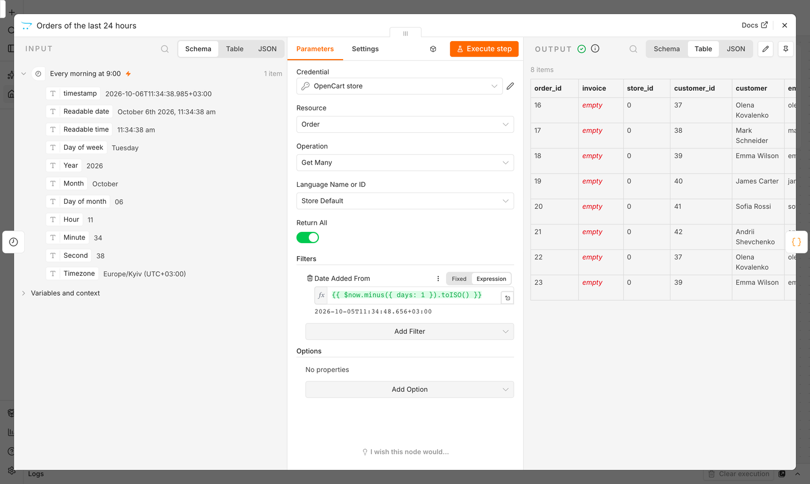
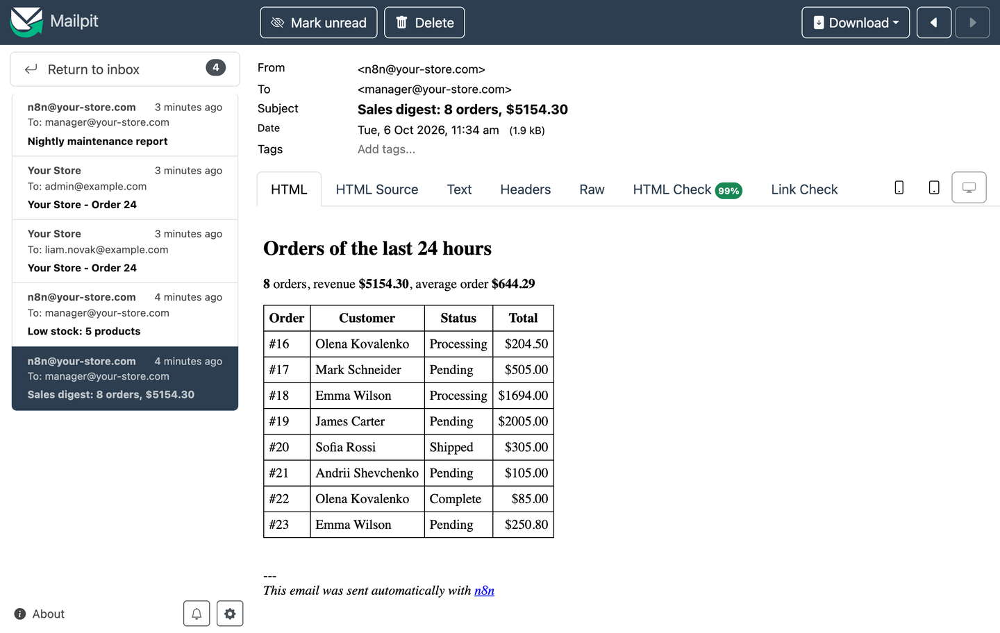
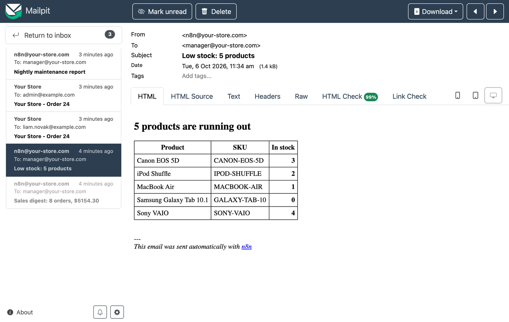
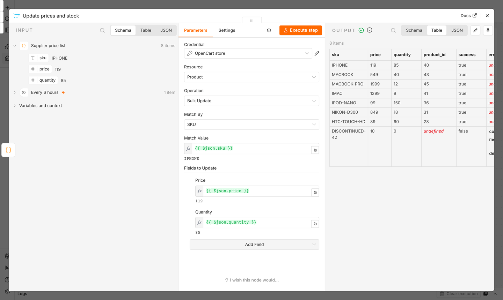
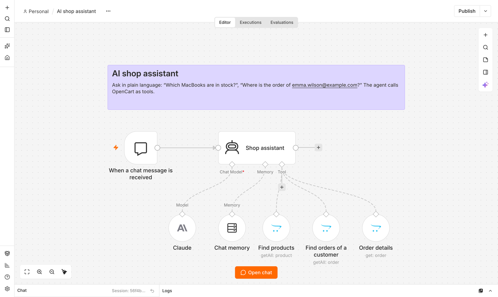
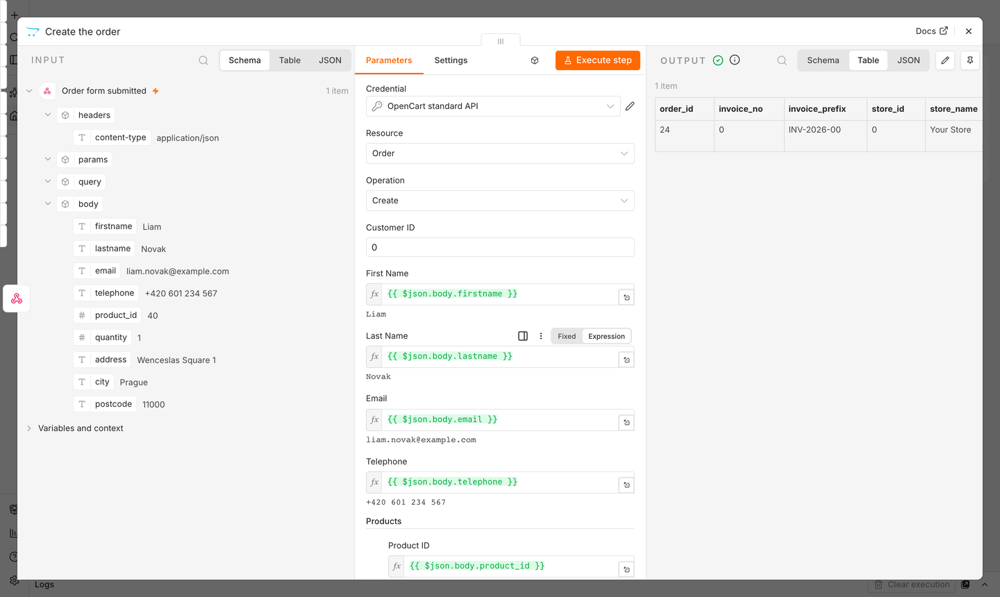
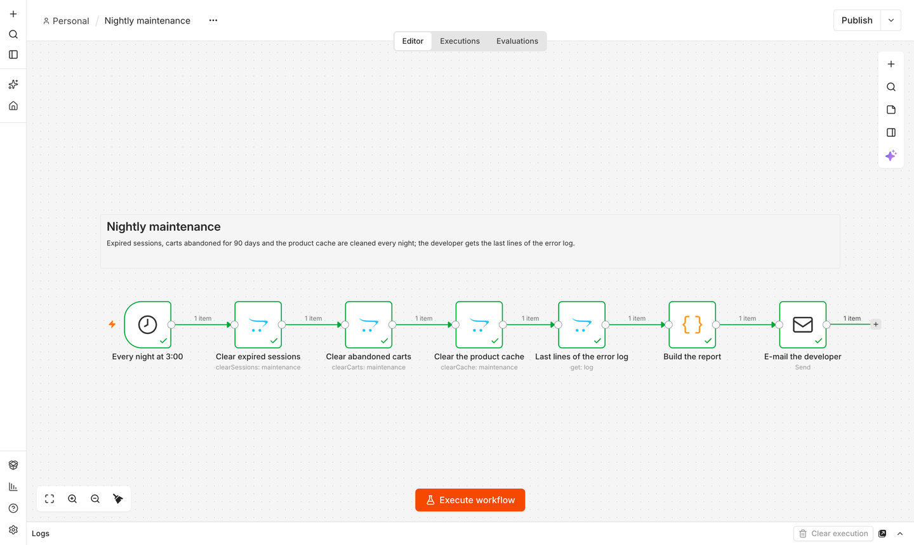

# @and-co-ua/n8n-nodes-opencart

This is an n8n community node. It lets you manage an [OpenCart](https://www.opencart.com/) 3
store in your n8n workflows: catalog, customers, orders, returns, gift vouchers, marketing
and maintenance tasks through the [n8n API extension](https://www.opencart.com/index.php?route=marketplace/extension/info&extension_id=49833), or orders through the API built into
OpenCart.

[n8n](https://n8n.io/) is a [fair-code licensed](https://docs.n8n.io/sustainable-use-license/)
workflow automation platform.

[Installation](#installation) ·
[Operations](#operations) ·
[Usage examples](#usage-examples) ·
[Credentials](#credentials) ·
[Compatibility](#compatibility) ·
[Development](#development) ·
[Resources](#resources)

## Installation

Install the package `@and-co-ua/n8n-nodes-opencart` in n8n — follow the
[community nodes installation guide](https://docs.n8n.io/integrations/community-nodes/installation/).

The node works in one of two modes. The credentials you select in the node choose it: **OpenCart API**
credentials use the Full API, **OpenCart Standard API** credentials the API built into OpenCart.

| | Full API | Standard OpenCart API |
|---|---|---|
| In the store | the [**n8n API** extension for OpenCart](https://www.opencart.com/index.php?route=marketplace/extension/info&extension_id=49833) (OpenCart Marketplace) | nothing to install: the API built into OpenCart 3 |
| Credentials | **OpenCart API** (key from the extension settings) | **OpenCart Standard API** (API user from **System → Users → API**) |
| Operations | everything listed under [Operations](#operations) | Order: Create, Quote, Get, Change Status, Delete |

For the standard API, add the IP address of your n8n server on the **IP Addresses** tab of the
API user.

## Operations

### Full API

| Resource | Operation | Description |
|---|---|---|
| Attribute | Create, Delete, Get, Get Many, Update | Product attributes (e.g. "Diagonal") within attribute groups. |
| Attribute Group | Create, Delete, Get, Get Many, Update | Groups of attributes (e.g. "Display"). |
| Category | Create, Delete, Get, Get Many, Update | Categories with parent, description, meta tags, SEO keyword, stores, filters, top menu settings. Delete also removes subcategories. |
| Coupon | Create, Delete, Get, Get History, Get Many, Update | Discount coupons with products, categories, dates and usage limits; Get Many can return only coupons active now; history lists the orders the coupon was used in. |
| Customer | Create, Delete, Get, Get Many, Update, Add / Get History, Add / Get Transactions, Add / Get Reward Points | Customers with addresses, custom fields, password (works for the storefront login; random when not set), store credit and reward points with balances. |
| Customer Approval | Approve, Deny, Get Many | Pending new customers and affiliates (no e-mail is sent). |
| Customer Group | Create, Delete, Get, Get Many, Update | Customer groups with approval setting. |
| Download | Create, Delete, Get, Get Many, Update | Downloadable files for products; the file is uploaded from an input binary field. |
| Filter Group | Create, Delete, Get, Get Many, Update | Filter groups with their filters (layered navigation). |
| Gift Voucher | Create, Delete, Get, Get History, Get Many, Send, Update | Gift vouchers with balance, usage history and e-mail to the recipient. |
| Image | Resize | URL of a resized copy of a store image (path relative to `image/`, as in products), made by the store's own image code. |
| Information Page | Create, Delete, Get, Get Many, Update | Pages like About Us or Delivery, with footer link, meta tags and SEO keyword. |
| Mail | Send | Mailing as Marketing → Mail in the admin panel: to newsletter subscribers, all customers, a customer group, selected customers or affiliates, or everyone who ordered given products. The node sends all batches and returns one summary item (`total`, `sent`, `failed`, `invalid`, `batches`). |
| Maintenance | Clear Abandoned Carts, Clear Cache, Clear Expired Sessions, Clear Template Cache | Cleanup tasks for scheduled workflows: carts of customers not changed for N days, a system cache key (e.g. `product`), expired sessions, compiled Twig templates. |
| Manufacturer | Create, Delete, Get, Get Many, Update | Brands with image, SEO keyword and stores. |
| Marketing Campaign | Create, Delete, Get, Get Many, Update | Tracking codes with the tracking URL, clicks and completed orders. |
| Option | Create, Delete, Get, Get Many, Update | Product options (select, radio, checkbox, text, date, …) with their values. |
| Order | Create, Update, Quote, Get, Get Many, Delete, Add / Get History, Create Invoice Number, Add / Remove Reward Points, Add / Remove Commission | Full order management through the store's own checkout: products with options, guest or registered customer, addresses, shipping and payment methods (codes from Quote), coupon, gift vouchers, reward points. Status changes subtract / return stock and send the store's e-mails as in the admin panel. |
| Product | Bulk Update, Copy, Create, Delete, Get, Get Many, Update | Products with prices, stock, descriptions, categories, attributes, options, discounts, specials, rewards, images (paths of existing files), related products and SEO keyword. Get Many filters for synchronisation: exact model / SKU, modified since, stock and price ranges, category with subcategories. |
| Return | Create, Delete, Get, Get Many, Update, Add / Get History | Product returns; customer and product data are taken from the order; status changes can e-mail the customer. |
| Review | Create, Delete, Get, Get Many, Update | Product reviews; filter by product, author, status and date, publish or edit them. |
| Log | Clear, Get | Error log or OCMOD log: the last lines (up to 10000) with size and date, or empty the log. |
| Lookup | Get Many | Reference lists: countries, currencies, customer groups, languages, layouts, order statuses, return actions, return reasons, return statuses, stores, tax classes, voucher themes, zones (optionally of one country). Translated lists accept a language. |
| System | Ping | Check the connection; returns API and module versions, OpenCart and PHP versions, access mode, the way the key was received, store name and server time. |

Drop-downs for languages, countries, zones, statuses, categories, manufacturers and other
reference data are loaded from the store.

**Bulk Update** (Product) treats every input item as one product: choose how items are
matched (SKU, model or product ID), map the match value and the fields to update (price,
quantity, status, stock status, …) with expressions. The node sends the items in batches of
500 and outputs one item per input item with `success` and, on failure, `error` — failed items
do not stop the others. Typical use: price and stock sync from a spreadsheet or an ERP.

**Product options** are set as JSON in the format of the API (see the module's `docs/API.md`):

```json
[{ "option_id": 5, "required": true,
   "values": [{ "option_value_id": 39, "quantity": 10, "price": 2, "price_prefix": "+" }] }]
```

**Orders.** Use **Quote** first to see which shipping and payment method codes the store offers
for the products and address, then **Create** with those codes. **Update** changes only what
you set (products and gift vouchers replace the lists); it does not send the store's order
e-mails again unless *Notify Customer* is on.

**Languages.** Texts (names, descriptions, meta tags, SEO keywords) are written in the
language selected in the node (the store default when empty). A new record gets a copy of the
text in all other languages until it is translated; an update changes only the selected
language and only the fields you set.

### Standard OpenCart API

| Resource | Operation | Description |
|---|---|---|
| Order | Create | Places an order the way the admin order form does: customer (guest or registered customer ID), products with options, payment and shipping addresses, coupon, gift voucher, reward points, shipping and payment method codes, comment, order status, affiliate, store and currency. Returns the order. |
| Order | Quote | Runs the same steps without saving: products, totals, available shipping and payment methods. |
| Order | Get | The order record. |
| Order | Change Status | Adds a status to the order history, optionally notifying the customer. |
| Order | Delete | Deletes the order. |

IDs (country, zone, order status, customer group, store) are entered as numbers.


## Usage examples

Ready-to-import workflows are in [`examples/`](examples). In n8n open **Workflows → Import from
File**, then select your credentials in the OpenCart and e-mail nodes.

**Daily sales digest** ([JSON](examples/1-daily-sales-digest.json)) — every morning
*Order → Get Many* with *Date Added From* = `{{ $now.minus({ days: 1 }).toISO() }}`, a Code node
builds an HTML table with revenue and the average order, *Send Email* delivers it.





**Low stock alert** ([JSON](examples/2-low-stock-alert.json)) — *Product → Get Many* with
*Quantity Max* = 5 and *Status* = enabled, a report to the purchasing team.



**Supplier price and stock sync** ([JSON](examples/3-supplier-price-and-stock-sync.json)) — the
supplier's price list (Google Sheets, CSV, FTP or an API; a Code node in the example) goes to
*Product → Bulk Update* matched by SKU. Up to 500 products per request; every item reports
`success` or the reason it failed, e.g. an unknown SKU.



**AI shop assistant** ([JSON](examples/4-ai-shop-assistant.json)) — an AI Agent with OpenCart
operations as tools: *Find products*, *Find orders of a customer*, *Order details*. Ask "Which
MacBooks are in stock?" or "Where is the order of emma.wilson@example.com?".



**Orders from a landing page** ([JSON](examples/5-orders-from-a-landing-page.json)) — a Webhook
receives the form and *Order → Create* of the **Standard OpenCart API** places the order through
the store checkout (prices, taxes, shipping, stock and the store's e-mails). With the Full API use
*Order → Quote* first to get the shipping and payment method codes.



**Nightly maintenance** ([JSON](examples/6-nightly-maintenance.json)) — *Clear Expired Sessions*,
*Clear Abandoned Carts* (90 days), *Clear Cache* (`product`), *Log → Get* and an e-mail report to
the developer.



## Credentials

### OpenCart API (Full API)

Create **OpenCart API** credentials:

| Field | Description |
|---|---|
| Store URL | Storefront URL without `index.php`, e.g. `https://shop.example.com`. |
| API Key | From **Extensions → Extensions → Modules → n8n API** in the OpenCart admin panel. |
| Send API Key As | `X-Api-Key` header (default), Bearer token, request body field, or query string. Switch only if your host strips headers; the query string must be enabled in the module settings. |
| Endpoint Route | `api/n8n` (default, works in maintenance mode) or `extension/module/n8n_api` if the `n8n_api` event is disabled in the store. |

The credential test calls **System → Ping**.

### OpenCart Standard API

| Field | Description |
|---|---|
| Store URL | Storefront URL without `index.php`, e.g. `https://shop.example.com`. |
| API Username | API user from **System → Users → API** (`Default` in a new store). |
| API Key | The key of that user. |

The node logs in for every item (`api/login`). The credential test logs in too and reports a
wrong key or an IP address that is not allowed.

Errors returned by the store keep their HTTP status and show the API error code
(e.g. `invalid_api_key`, `read_only_mode`, `license_required` — the module is not activated
for the store yet; the credential test reports it too). A non-JSON response (wrong URL, module not
installed, disabled event) is reported with a hint on what to check.

## Compatibility

- OpenCart 3.0.3.x – 3.0.5.1. Full API: the [n8n API extension](https://www.opencart.com/index.php?route=marketplace/extension/info&extension_id=49833) (API version 1, module 1.0.0+); Standard
  OpenCart API: an enabled API user.
- Tested with the latest n8n release.

## Development

```bash
npm install
npm run lint
npm run build
npm run dev     # starts n8n with this node on http://localhost:5678
```

## Resources

- [n8n community nodes documentation](https://docs.n8n.io/integrations/#community-nodes)
- [OpenCart documentation](https://docs.opencart.com/)

## License

[MIT](LICENSE)
